<!-- =========================
     PREMIUM GITHUB PROFILE
========================= -->

  

  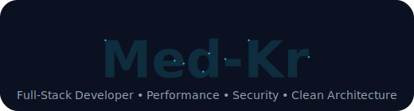

<h1 align="center">Hi, I'm Mohammed Kassir 👋</h1>
<h3 align="center">Full-Stack Developer • DevOps Enthusiast • Security-Oriented Builder</h3>

  I design and build modern, scalable, and high-performance web applications with a strong focus on clean architecture, user experience, and secure systems.

  
  
  
  

---

<h1  align="center" >🚀 Aʙᴏᴜᴛ Mᴇ 🚀</h1>

  

  

<table align="center">
  <tr>
    <td align="center" width="48%">
      
    </td>
    <td align="left" width="52%">
      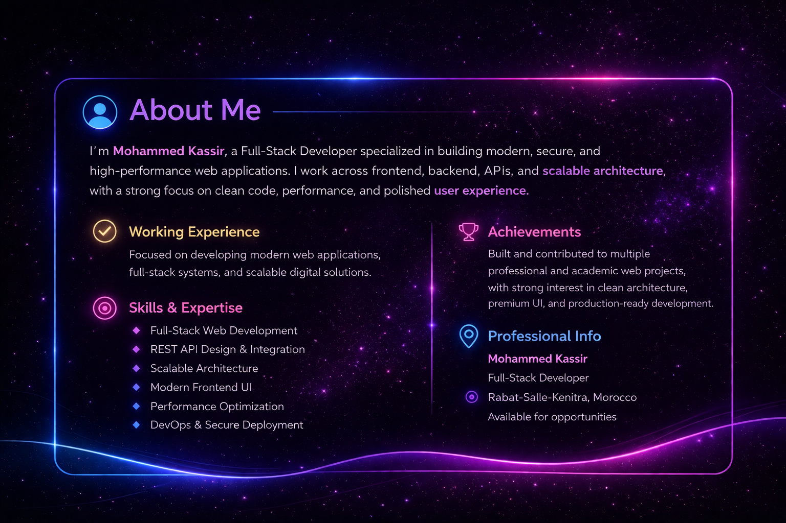
    </td>
  </tr>
</table>

  
  
  
  

---

<h1  align="center" >🧠 What I Focus On 🧠</h1>

  

  
  
  
  
  

<table align="center">
  <tr>
    

  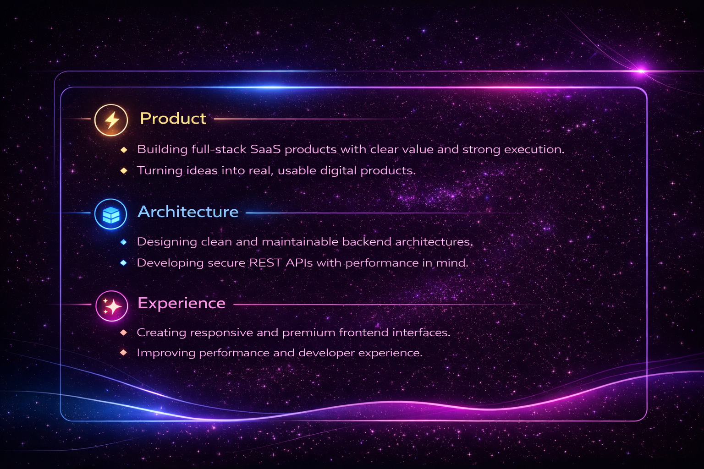

</table>

---

<h1  align="center" >🛠 Tech Stack 🛠</h1>

  

  

  
  
  
  

---

<h1  align="center" >🔥 Featured Projects 🔥</h1>

  

<table align="center">
  <tr>
    <td width="50%" valign="top">
      

        <a href="https://github.com/Med-kr/CareAI" target="_blank">
          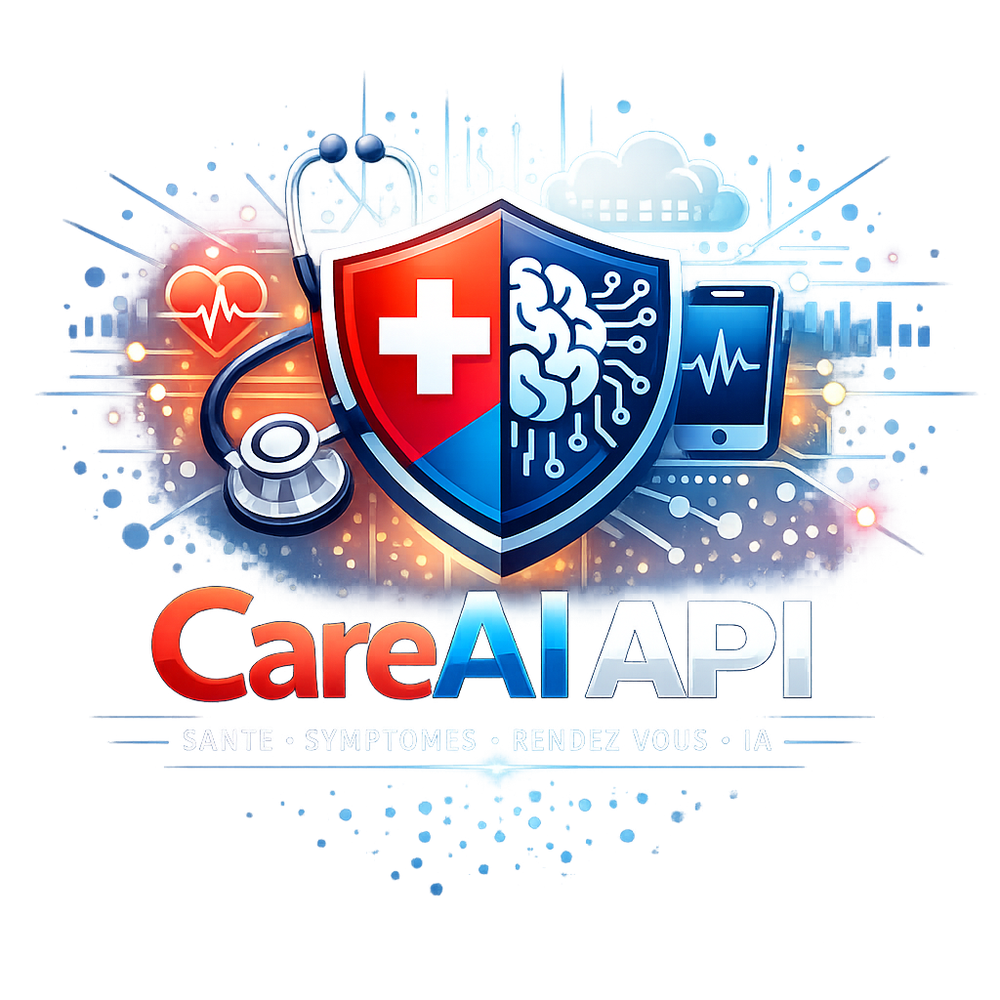
        </a>
         
        <strong><a href="https://github.com/Med-kr/CareAI" target="_blank">CareAI</a></strong>
         
        Laravel health assistant API for symptoms, doctors, appointments, and AI wellness guidance.
         
        Laravel • OpenAI • REST API
      

    </td>
    <td width="50%" valign="top">
      

        <a href="https://github.com/Med-kr/Confiance" target="_blank">
          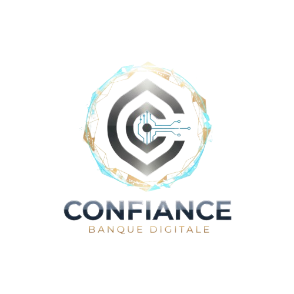
        </a>
         
        <strong><a href="https://github.com/Med-kr/Confiance" target="_blank">Confiance</a></strong>
         
        Banking management system with clients, accounts, transactions, dashboard, and secure auth.
         
        PHP • MySQL • Dashboard
      

    </td>
  </tr>
  <tr>
    <td width="50%" valign="top">
      

        <a href="https://github.com/Med-kr/SymptoAI" target="_blank">
          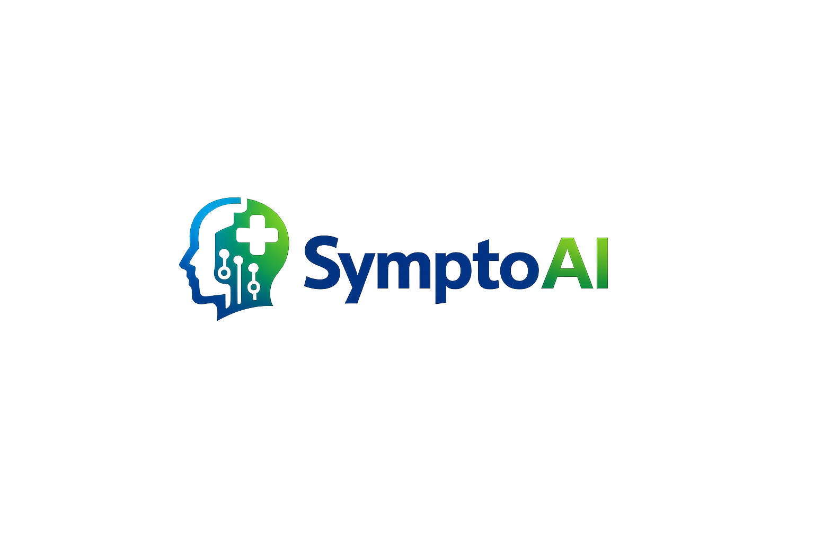
        </a>
         
        <strong><a href="https://github.com/Med-kr/SymptoAI" target="_blank">SymptoAI</a></strong>
         
        Health-oriented frontend experience centered on symptom workflows and interactive product design.
         
        React • Vite • UI
      

    </td>
    <td width="50%" valign="top">
      

        <a href="https://github.com/Med-kr/ATLAS" target="_blank">
          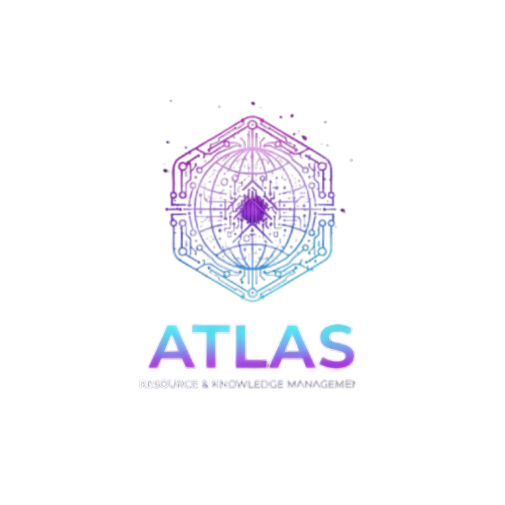
        </a>
         
        <strong><a href="https://github.com/Med-kr/ATLAS" target="_blank">ATLAS</a></strong>
         
        Laravel application foundation designed for scale, structure, and clean architecture.
         
        Laravel • PHP • Architecture
      

    </td>
  </tr>
  <tr>
    <td width="50%" valign="top">
      

        <a href="https://github.com/Med-kr/Groupify" target="_blank">
          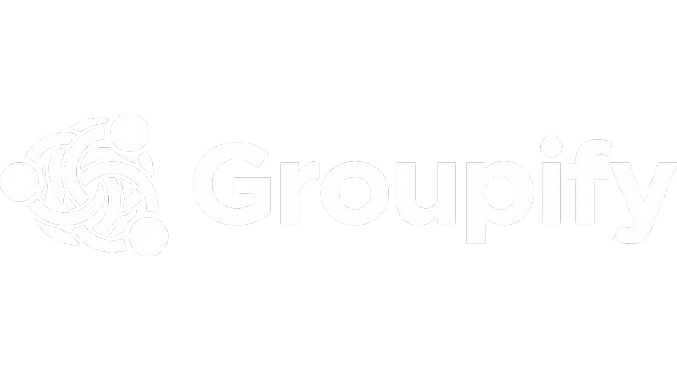
        </a>
         
        <strong><a href="https://github.com/Med-kr/Groupify" target="_blank">Groupify</a></strong>
         
        Contact and group management app with CRUD workflows, relationships, and responsive UI.
         
        Laravel • Tailwind • MySQL
      

    </td>
    <td width="50%" valign="top">
      

        <a href="https://github.com/Med-kr/TrackZen" target="_blank">
          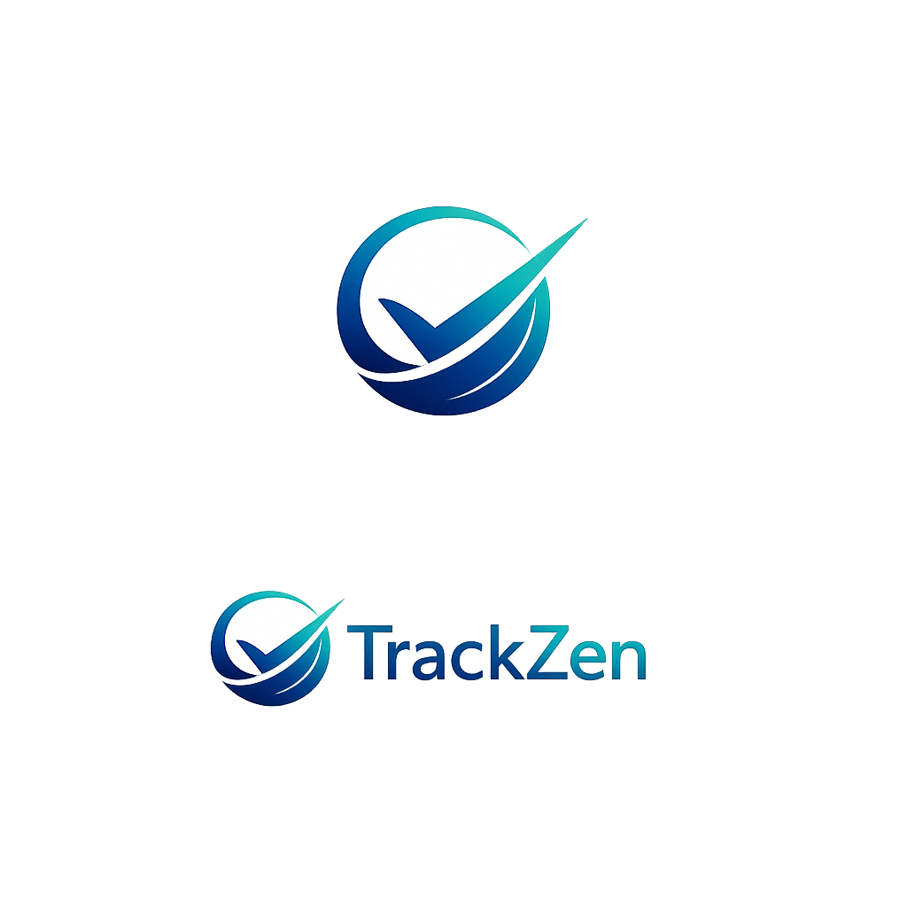
        </a>
         
        <strong><a href="https://github.com/Med-kr/TrackZen" target="_blank">TrackZen</a></strong>
         
        Habit and productivity backend starter built around auth, streaks, logs, and APIs.
         
        Laravel • Livewire • Sanctum
      

    </td>
  </tr>
  <tr>
    <td width="50%" valign="top">
      

        <a href="https://github.com/Med-kr/GridView" target="_blank">
          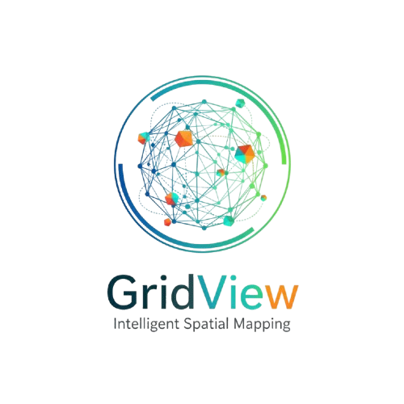
        </a>
         
        <strong><a href="https://github.com/Med-kr/GridView" target="_blank">GridView</a></strong>
         
        Employee management system with grid cards, search, local persistence, and profile photos.
         
        JavaScript • CSS Grid • localStorage
      

    </td>
    <td width="50%" valign="top">
      

        <a href="https://github.com/Med-kr/EstimaCredit" target="_blank">
          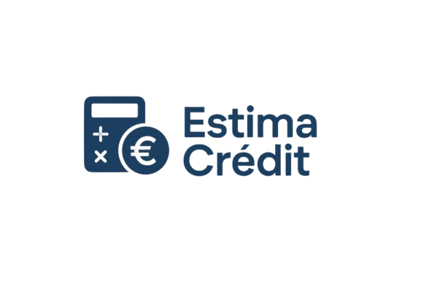
        </a>
         
        <strong><a href="https://github.com/Med-kr/EstimaCredit" target="_blank">EstimaCredit</a></strong>
         
        Smart loan simulator with financial planning, charts, and ethics-aware guidance.
         
        HTML • Tailwind • JavaScript
      

    </td>
  </tr>
</table>

---

  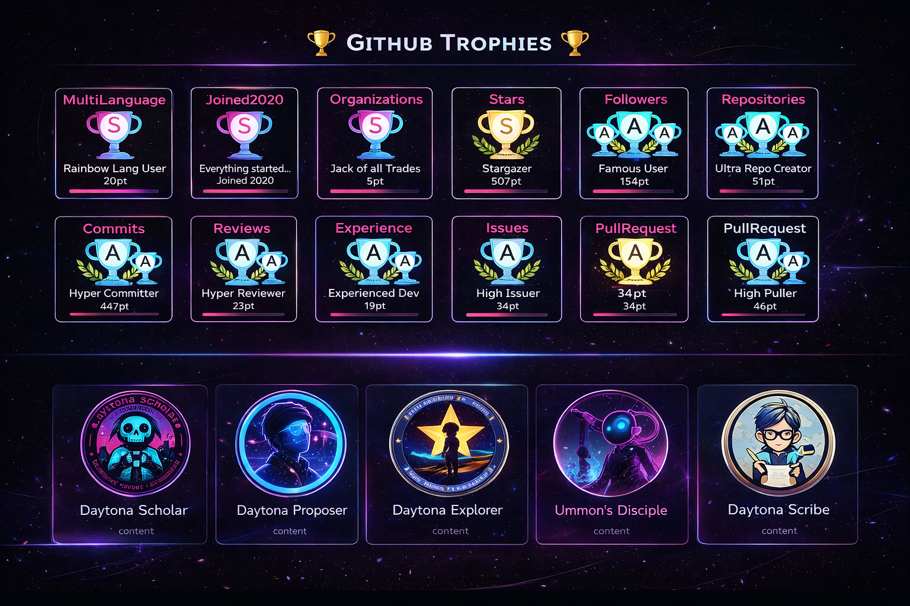

 
 
 
 
 

  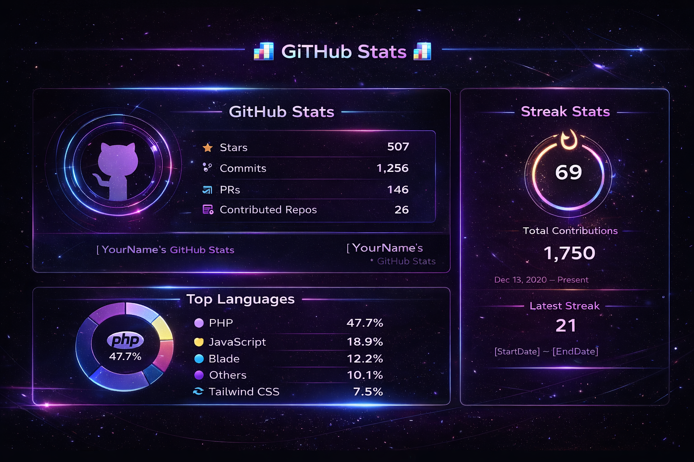

<h1  align="center" >🤝 Cᴏɴɴᴇᴄᴛ Wɪᴛʜ Mᴇ 🤝</h1>

  

  
  &nbsp;&nbsp;&nbsp;&nbsp;
  
  &nbsp;&nbsp;&nbsp;&nbsp;
  
  &nbsp;&nbsp;&nbsp;
  
  &nbsp;&nbsp;&nbsp;&nbsp;
  
  &nbsp;&nbsp;&nbsp;&nbsp;
  
  &nbsp;&nbsp;&nbsp;&nbsp;
  
  &nbsp;&nbsp;&nbsp;&nbsp;
  

  
  
  
  
  
  
  
  

  

<h1  align="center" >✨ Pᴇʀsᴏɴᴀʟ Mᴏᴛᴛᴏ ✨</h1>

  

  

  

<h1  align="center" >💫 Tʜᴀɴᴋꜱ ꜰᴏʀ Vɪꜱɪᴛɪɴɢ Mʏ Pʀᴏꜰɪʟᴇ 💫</h1>

  

  

  <b>Thanks for visiting my profile 👨‍💻</b> 
  Building modern, secure and impactful digital experiences.

  

